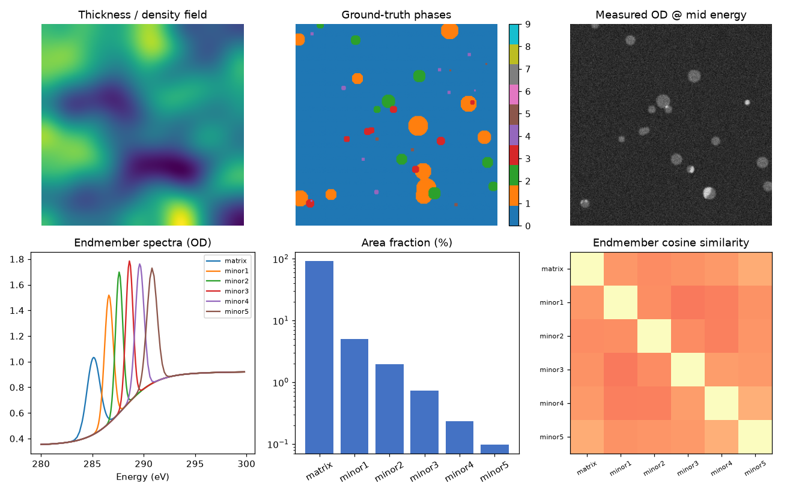
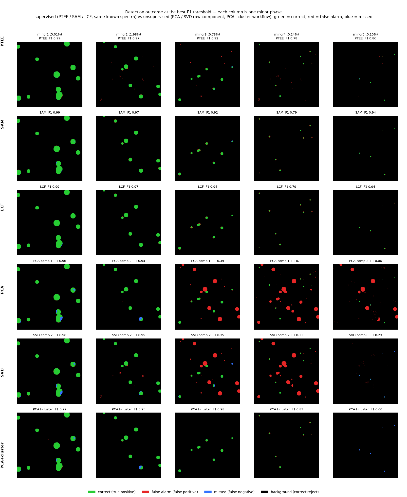
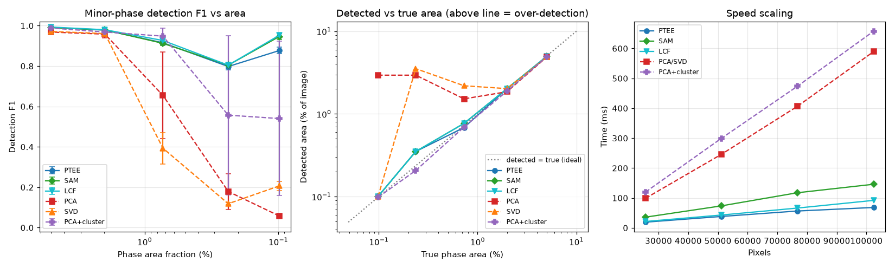

# PTEE vs SVD/PCA — phantom benchmark

Auto-generated by `benchmark.py`. Re-run to regenerate figures, metrics and this report.

## Setup

- Phantom: **320×320 px**, 114 energies, phases: matrix, minor1, minor2, minor3, minor4, minor5.
- Poisson noise at I0 = 350 counts; a smooth thickness/density field (0.6–1.4) multiplies every pixel so total absorption ≠ composition.
- Endmembers: distinct π* resonances on a real UVSOR C K-edge energy grid (`data/endmembers.npz`); matrix, minor1, minor2, minor3, minor4, minor5.
- **Two families of methods are compared:**
    - **Supervised (given the same known endmember spectra):** **PTEE** (per-pixel min–max R²), **SAM** (spectral-angle correlation, the classic hyperspectral target-detection analog), and **LCF** (non-negative linear-combination fit, the standard supervised unmixing). All three receive *identical* reference spectra, so PTEE has **no information advantage** over SAM/LCF — the comparison isolates the matching rule and the cost. (`--seedref` estimates the references from seed regions instead of the library.)
    - **Unsupervised:** **PCA / SVD** with 3 components (raw-component lower bound), each scored by its **oracle best component**; and **PCA+cluster** — the realistic standard variance workflow (Lerotic 2004 / MANTiS): k-means on the PCA scores (k ∈ {6, 12}, 10 components), each **cluster labelled by its dominant (majority) phase** (the standard way clusters become a phase map), scanning the k values and keeping the best per phase.
- Detection metrics averaged over **3 phantom realizations** (mean ± std): **F1** (headline), the **detected area %** (how much of the image each method flagged — compare with the phase's true area), and **det.%** (recall — how much of the phase was found).
- PTEE R² reproduces the GUI's `spectral_r2_map` to 0.0e+00.



## Detection metrics — F1 and detected area %

Detection is a per-pixel yes/no decision — *is this pixel the phase?* — after thresholding a method's detection map and comparing to the ground truth. Each pixel is then:

- **TP** (true positive): phase pixel, correctly flagged.
- **FP** (false positive): background/other-phase pixel, wrongly flagged (a *false alarm*).
- **FN** (false negative): phase pixel, *missed*.
- **TN** (true negative): background, correctly left out.

```
Precision = TP / (TP + FP)          (fraction of flagged pixels that are correct)
Recall    = TP / (TP + FN)          (fraction of the phase that was detected)
F1        = 2·Precision·Recall / (Precision + Recall)
```
$$F_1=\frac{2\,\mathrm{TP}}{2\,\mathrm{TP}+\mathrm{FP}+\mathrm{FN}}=2\cdot\frac{\mathrm{Precision}\cdot\mathrm{Recall}}{\mathrm{Precision}+\mathrm{Recall}}\in[0,1]$$

**F1** (harmonic mean of precision and recall) is the headline: it is low if *either* many pixels are missed *or* many false alarms occur — the right score for the heavily imbalanced minor phases, where plain accuracy is meaningless. The table also gives two area numbers at each method's own best-F1 threshold:

- **detected area %** = flagged pixels as a percent of the whole image. Compare it with the phase's **true area %** (2nd column): ≈ equal = accurate; **much larger = over-detection** (the method paints far more of the image than the phase actually occupies — false alarms).
- **det.%** = recall = the percent of the phase's own pixels that were found.

Together they separate the two failure modes: a small det.% means the phase was *missed*; a detected area % far above the true area (with det.% still high) means the phase was *found but swamped by false alarms* — which is what happens to SVD/PCA on the small phases.

## Minor-phase detection (mean ± std over realizations)

### Table 1 — detection F1 (higher = better)

Supervised (PTEE / SAM / LCF, same known spectra) | unsupervised (PCA / SVD raw component, PCA+cluster = the realistic MANTiS-style workflow).

| phase | true area % | PTEE | SAM | LCF | PCA | SVD | PCA+cluster |
|---|---|---|---|---|---|---|---|
| matrix | 92.16 | **0.703±0.001** | 0.703±0.001 | 0.703±0.001 | 0.703±0.001 | 0.703±0.001 | 0.998±0.001 |
| minor1 | 5.01 | **0.991±0.002** | 0.990±0.002 | 0.993±0.003 | 0.968±0.009 | 0.971±0.008 | 0.988±0.001 |
| minor2 | 1.98 | **0.978±0.006** | 0.979±0.005 | 0.980±0.005 | 0.958±0.018 | 0.961±0.014 | 0.969±0.021 |
| minor3 | 0.73 | **0.915±0.009** | 0.913±0.009 | 0.927±0.011 | 0.655±0.214 | 0.393±0.078 | 0.948±0.040 |
| minor4 | 0.24 | **0.798±0.017** | 0.804±0.014 | 0.804±0.014 | 0.179±0.089 | 0.119±0.005 | 0.557±0.394 |
| minor5 | 0.10 | **0.877±0.016** | 0.946±0.014 | 0.952±0.011 | 0.058±0.006 | 0.207±0.023 | 0.540±0.382 |

Minor-phase mean F1 — supervised: **PTEE 0.912**, SAM 0.927, LCF 0.931; unsupervised: PCA 0.564, SVD 0.530, PCA+cluster 0.800.

### Table 2 — detected area % (compare with the true area % — much larger = over-detection)

| phase | true area % | PTEE | SAM | LCF | PCA | SVD | PCA+cluster |
|---|---|---|---|---|---|---|---|
| matrix | 92.16 | 50.00 | 50.00 | 50.00 | 50.00 | 50.00 | 92.23 |
| minor1 | 5.01 | 4.95 | 4.95 | 4.95 | 4.86 | 4.86 | 4.91 |
| minor2 | 1.98 | 2.02 | 2.02 | 2.02 | 1.86 | 2.02 | 1.89 |
| minor3 | 0.73 | 0.69 | 0.77 | 0.77 | 1.52 | 2.19 | 0.69 |
| minor4 | 0.24 | 0.35 | 0.35 | 0.35 | 2.94 | 3.53 | 0.21 |
| minor5 | 0.10 | 0.10 | 0.10 | 0.10 | 2.94 | 0.10 | 0.10 |



**How to read Fig. 2 (detection outcome).** Each column is one minor phase; each row a method (top three supervised — PTEE / SAM / LCF, all given the same known spectra — then unsupervised PCA / SVD raw component and the PCA+cluster workflow). Every method's detection map is thresholded at its own best-F1 point and coloured directly: **green = correct (true positive)**, **red = false alarm (false positive)**, **blue = missed (false negative)**, black = background. A method that works shows mostly green with little red/blue. The three supervised methods (PTEE / SAM / LCF) all stay green even for the tiny phases, while the unsupervised ones fail as area shrinks (left→right): raw PCA/SVD over-detect (red). PCA+cluster keeps up on the moderate phases (it even edges PTEE at ~0.7 %) but breaks down on the smallest — k-means gives a ~0.1 %-area phase no cluster of its own, so it is absorbed into the matrix cluster and **missed** (blue); whether a given ≤0.25 % phase happens to get its own cluster varies from realization to realization, which is why its error bars in fig 3 are large. The split is **supervised (target-driven) vs unsupervised (variance-driven)**, not PTEE vs everything.



**How to read Fig. 3.** Left: detection **F1** vs phase area (log axis, small phases to the right) — the supervised methods (PTEE / SAM / LCF) stay high; raw PCA/SVD collapse below ~1 %; PCA+cluster keeps up to ~0.5 % then drops with large error bars on the smallest phases. Middle: **detected area vs true area** (log–log) — points on the dotted line detect exactly the phase's area; **above** = over-detection (false alarms), **below** = under-detection (missed). The supervised methods sit on the line; raw PCA/SVD rise above it (over-detect); PCA+cluster falls below it for the smallest phases (misses them). Right: wall-clock **time vs pixel count** — PTEE and SAM are the cheapest and scale most gently; the PCA/SVD decomposition and the PCA+cluster workflow are far costlier.

## Speed

Timed **single-threaded (BLAS/OpenMP pinned to 1 thread)** for reproducibility. Absolute times still depend on the CPU, so the portable results are the **relative speed-up** and the **scaling slope**, not the milliseconds.

- **Measured on:** Apple M4 (10 physical / 10 logical cores, 17.2 GB RAM), macOS-26.6.2-arm64-arm-64bit-Mach-O.
- **Software:** Python 3.13.4, numpy 2.5.3 (BLAS: accelerate), scipy 1.18.1; single process, threads pinned to **1**.
- **PTEE** (all references, min–max R²): **67.4 ms**
- **SAM** (spectral-angle correlation, supervised): 146.1 ms
- **LCF** (non-negative linear-combination fit, supervised): 91.1 ms
- **PCA** (centered SVD): 580.3 ms
- **SVD** (uncentered): 575.4 ms
- **PCA+cluster** (PCA + k-means, the realistic workflow): 654.0 ms
- The supervised target methods are all cheap closed-form passes: PTEE ≈ SAM (~67–146 ms), LCF 91 ms. PTEE is ~**8.6×** faster than a bare PCA/SVD decomposition and ~**9.7×** faster than the full PCA+cluster workflow, and scales more gently with pixel count (fig 3, right).
- **Non-negativity comes free with PTEE.** Obtaining *physically non-negative, interpretable* component spectra and abundances from the variance route needs a further **iterative MCR-ALS / NMF** step on top of PCA (+cluster), which repeats a decomposition of this size many times — so the real-world speed gap is larger still. PTEE uses measured spectra as endmembers, so non-negativity holds by construction with no iteration.

## Takeaways

- **The real split is supervised vs unsupervised, not PTEE vs everything.** Given the same known spectra, PTEE, SAM and LCF all detect even the smallest phases (mean minor-phase F1 0.91 / 0.93 / 0.93), while every unsupervised route collapses — raw PCA/SVD 0.56 / 0.53, and the realistic **PCA+cluster (MANTiS-style) workflow 0.80**. So the result is not an artifact of comparing against a 'raw' PCA straw man: the standard clustering workflow fails on the small phases too. PTEE having the reference spectra is **not** what wins — SAM and LCF have them and behave the same.
- **Two different unsupervised failure modes, same outcome:** raw PCA/SVD **over-detect** (one variance component lights up on several phases → false alarms, detected area ≫ true area), while PCA+cluster **misses** the smallest phases — k-means spends its k clusters on the high-variance/thickness structure and never gives a ~0.1 %-area phase a cluster of its own, so those pixels are absorbed into a bigger cluster. The supervised methods avoid both: each reference matches only its own phase, so detected area tracks the true area.
- **Thickness robustness:** the thickness field is the largest source of variance, so it dominates the leading PCA/SVD components; PTEE (min–max), SAM (scale/offset-invariant) and LCF (abundance ratio) all remove it.
- **What PTEE adds over the other supervised methods** is not detection accuracy — SAM and LCF match it here — but a combination of practical properties: it is **among the fastest** (a few vectorized passes, no per-pixel solve like LCF, no iteration like MCR-ALS/NMF), it uses **physically real endmembers** so **non-negativity is automatic**, and R² is a **bounded [0,1] per-phase fit quality** that doubles as the phase-assignment gate. The honest positioning: PTEE is the simplest, cheapest member of the supervised/target-driven family, which as a family is what beats variance methods on minor phases.
- **Caveat:** all supervised methods (PTEE / SAM / LCF) need target spectra and can only find phases whose spectral signature is anticipated; the unsupervised routes (PCA/SVD, PCA+cluster) can in principle flag *unexpected* variance. The comparison reflects the intended use — mapping *known/target* minor phases — and PTEE's peak-map step is what surfaces candidate targets in the first place, recovering much of that exploratory value.
